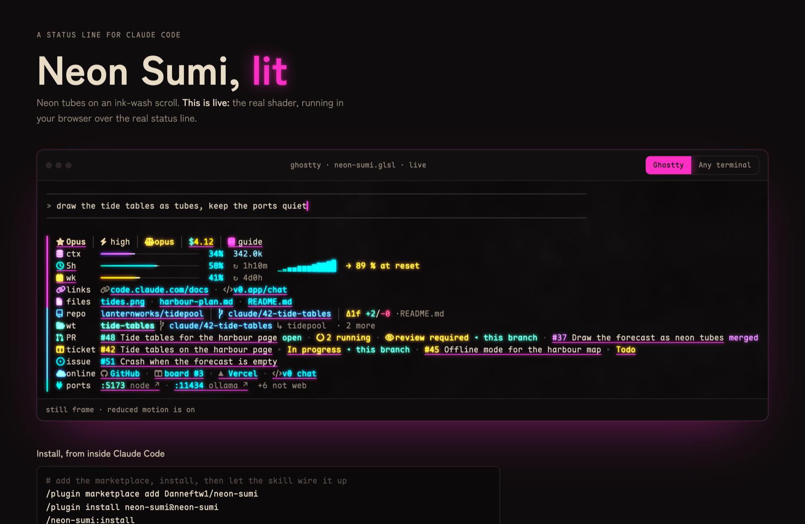
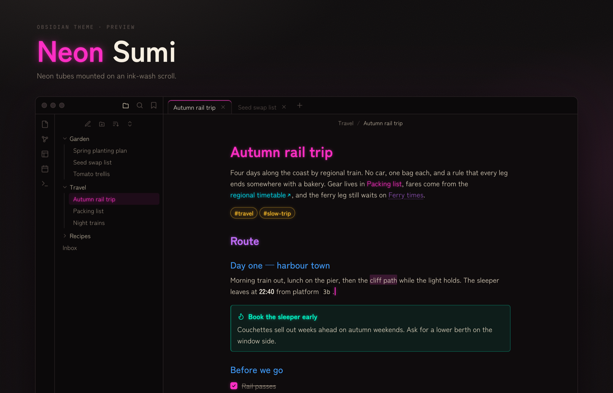

# Neon Sumi

**A status line for [Claude Code](https://code.claude.com) that tells you where you stand, so you don't have to ask.**

Context left, the 5-hour and weekly limits, the branch and its PR, the tickets you mentioned, the dev server that is
actually up. One glance below the prompt, drawn as neon tubes on an ink-wash scroll.

Free and open source (MIT). Python standard library only, plus one TypeScript module that Claude Code itself runs
for the cockpit pane. Three commands to install.



**[See it running live →](https://danneftw1.github.io/neon-sumi/)** The real shader over the real status line, in
your browser, with a toggle for terminals without shaders. The repo, tickets and ports in it are made up.

## Why you might want it

- **You stop asking.** How much context is left, whether CI passed, which port the app is on: the answers are already
  on screen, refreshed every second.
- **It stays out of the way.** About 30 ms per render on a current Python (about 150 ms on the Python 3.9 macOS
  ships, which the install skill steers you off), one Python process, and nothing on the render path touches the
  network. GitHub and ports are collected in the background and share one cache across every open session.
- **Colour means something.** Neon is reserved for what is live: bar fills, percentages, state, links. Everything
  static is warm ink and paper. Bars turn amber at 70 % and red at 85 %, so the only thing that stands out is the
  thing that needs you.
- **Nothing to take on trust.** No pip install, no account, no telemetry. It talks to your own `localhost` and, through
  your own `gh`, to GitHub. About 2,500 lines of Python and 180 of TypeScript you can read in an afternoon.

## Install

In Claude Code:

```
/plugin marketplace add Danneftw1/neon-sumi
/plugin install neon-sumi@neon-sumi
/neon-sumi:install
```

The install skill copies the files to `~/.claude/neon-sumi/`, renders once so you can see it works, and asks before it
changes `statusLine` and `subagentStatusLine` in `~/.claude/settings.json`. It keeps a backup of your settings.
A plugin cannot change `statusLine` in `settings.json`, which is why that last step exists. When the plugin updates,
run `/neon-sumi:install` again: it copies the new files and keeps your `config.json`.

**Needs**: Python 3.9+ as `python3` on your PATH, a [Nerd Font](https://www.nerdfonts.com) in the terminal, `git`.
Optional: an authenticated `gh` for the GitHub rows and the cockpit, `jq` for the subagent line, `docker` for container
ports.

<details>
<summary>Manual install</summary>

Copy `plugins/neon-sumi/statusline/` to `~/.claude/neon-sumi/` and add to `~/.claude/settings.json`:

```json
"statusLine": { "type": "command", "command": "python3 -B ~/.claude/neon-sumi/statusline.py", "refreshInterval": 1 },
"subagentStatusLine": { "type": "command", "command": "sh ~/.claude/neon-sumi/subagent.sh" }
```

</details>

## What it shows

**Claude**: model, effort, advisor, session cost. Context, 5-hour and weekly usage as three bars, each in its own
colour until it reaches 70 % (amber) and 85 % (red). Web links and readable files (documents, images, video; never
code or config) mentioned in the conversation, as clickable chips.

**GitHub**: repo, branch, ahead/behind and the uncommitted diff. The worktree you are in, or, in the main checkout, the
worktrees your agents are using. One row each for PRs, board tickets and plain issues mentioned in the chat, every
number with its title and state, a ticket with its board column. The branch's own PR comes first, with CI and review
state. Then where the repo lives online: GitHub, plus any board, deploy or design links you add.

**Machine**: local ports that actually serve a page, as links. Ports that only answer with an error are counted, not
linked.

Every row fits the pane. Claude Code tells the status line how wide the terminal is, and a row that would wrap drops
chips from the right at a chip boundary and ends in `…`. On a short terminal, `"layout": "compact"` puts links and
files on one row and leaves out the online row.

## The cockpit

Everything that is the same in every session lives in a separate view for a narrow pane: your 5-hour and weekly
limits, every port grouped by owner, all your open PRs, the GitHub inbox, the skills Claude loaded this week and the
ones that stayed silent, your boards and the Claude Code hotkeys you want in view. Live data comes first, and every
block says how old its data is.

```
/neon-sumi-cockpit
```

opens it as a pane inside Claude Code, redrawn every two seconds at the pane's width: beside the transcript in the
fullscreen layout from 110 columns, above the prompt otherwise. Close it with the pane's close mark or `ctrl+x x`. It
needs Claude Code 2.1.287 or newer, where a plugin may draw a pane, and `python3` on your PATH. The command is there as
soon as the plugin is enabled, and the pane takes its 5-hour and weekly bars from the session itself, so it needs no
install step.

The same view runs in any terminal split, for older Claude Code or a tmux pane of its own:

```
python3 -B ~/.claude/neon-sumi/cockpit.py
```

It is designed for 56 columns and wider. `--once` prints one frame.

## Ghostty edition

In [Ghostty](https://ghostty.org) the status line switches to tubes by itself: bars drawn with box-drawing strokes
that Ghostty renders edge to edge, a sparkline of the last hour on the 5h row, and where you will land at reset at the
current pace (`→ 89 % at reset`, or `cap in 38m` in red).

`ghostty/neon-sumi.glsl` is a custom shader that makes the neon glow: bloom on saturated colours only, a slow current
along the tubes, an ink-wash grain on the background and a short comet behind the cursor. To use the theme, shader and
Display P3 colour, add one line to your Ghostty config:

```
config-file = ~/.claude/neon-sumi/ghostty/neon-sumi.ghostty
```

The shader lights the whole terminal, not only the status line. `custom-shader-animation = false` in that file keeps
the glow and stops the motion.

Every other terminal (iTerm2, Terminal, Windows Terminal) gets the classic edition: the same rows, no shader.

## Obsidian

`obsidian/` has a matching Obsidian theme and a profile for the community Terminal plugin, so a terminal inside
Obsidian gets the same colours. See [obsidian/README.md](obsidian/README.md).



## Matching themes

The palette lives in one file, `design/tokens.json`, and `tools/build_themes.py` turns it into themes for the tools
around the terminal:

| Tool | File |
| --- | --- |
| Claude Code | `plugins/neon-sumi/themes/neon-sumi.json`, ships with the plugin: `/theme` → Neon Sumi |
| Zed | `themes/zed/neon-sumi.json` |
| iTerm2 | `themes/iterm2/Neon Sumi.itermcolors` |
| Ghostty, Obsidian | `plugins/neon-sumi/statusline/ghostty/` and `obsidian/`, palettes kept in step with the tokens |

[themes/README.md](themes/README.md) says how to load each one.

## Configure

Everything works without a config file. To add links, copy `config.example.json` to `~/.claude/neon-sumi/config.json`:

| Key | What it does |
| --- | --- |
| `edition` | `auto` (default), `classic` or `tubes` |
| `layout` | `full` (default) or `compact`: links and files share a row, no online row |
| `repos` | extra links per `owner/name` for the online row: board, Vercel, v0, anything |
| `boards`, `services`, `resources` | links in the cockpit |
| `keys` | `{key, what}` pairs for the cockpit's hotkey block; list the ones you keep forgetting |
| `guide_url` | adds a guide chip to the first row |
| `vaults` | Obsidian vaults: `.md` files inside open in Obsidian instead of as files |
| `cost_warn`, `cost_crit` | session cost in dollars where the cost chip turns amber and red (default 3 and 8) |
| `width` | row width in columns, if the terminal reports it wrong |
| `width_reserve` | columns kept free on the right (default 2, plus your `statusLine` padding) |

## Uninstall

Restore `~/.claude/settings.json.bak-neon-sumi` (or remove the two keys), then delete `~/.claude/neon-sumi/` and
`~/.cache/neon-sumi/`. `/plugin uninstall neon-sumi@neon-sumi` removes the plugin itself.

## Development

`tools/fixtures.py` builds a made-up world (a git repo with worktrees, PRs, tickets, ports) and `tools/build_docs.py`
renders the site, `docs/index.html`, from it:

```
uv run --no-project --with fonttools --with brotli python tools/build_docs.py
```

The themes are generated too. Change a colour in `design/tokens.json`, then:

```
python3 tools/build_themes.py          # every port, from the tokens
python3 tools/build_themes.py --check  # colours in the repo that are not tokens
```

### The site's theme

Neon Sumi itself is dark: the status line, cockpit, shader and the Obsidian, iTerm2, Zed and Claude Code themes stay
as the tokens draw them. The site, `docs/index.html`, follows a different rule:

- Light is the default theme. Dark exists only behind an explicit toggle; it never switches on its own from
  `prefers-color-scheme`.
- The light theme is dimmed and easy on the eyes: no white or near-white grounds. The brightest surface stays at or
  below OKLCH L 0.82 (roughly `#C3BFB5` for a warm grey); the page ground sits a step darker; greys carry a slight hue.
- Ink is softened, but body text keeps 4.5:1 on every ground it sits on (3:1 for large text, control borders, focus
  rings, icons). A dimmer ground means darker secondary ink to keep the ratio.
- Accents drop in lightness and chroma to match: no glaring saturated fills.

A palette that meets it: panel `#B4B0A7` (L 0.76), dial `#C3BFB5` (L 0.81), ink `#191B1D`, ink-2 `#3C3F43`, accent
`#B9721A`. Today's site is still dark only; it changes when `tools/build_docs.py` is next reworked.

Issues and pull requests are welcome.

## License and credits

MIT, see [LICENSE](LICENSE). Typeset in [Maple Mono](https://github.com/subframe7536/maple-font) (SIL OFL 1.1); icons
from [Nerd Fonts](https://www.nerdfonts.com).
